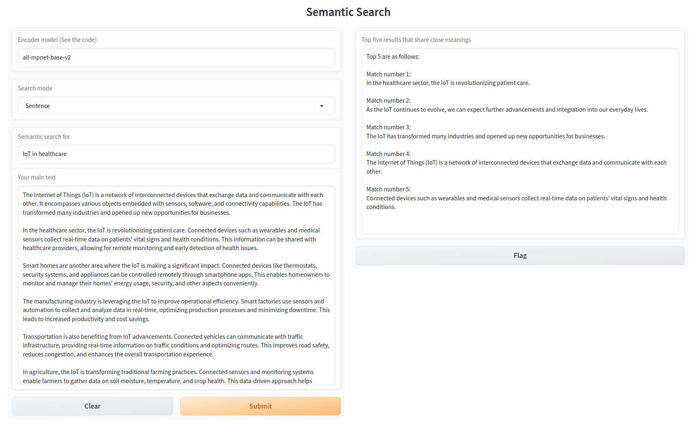

# Semantic Search

This is a semantic search contains a Python code that compares the encoded representation of the query with the encoded representation of each paragraph in the context and selects the top k most similar results.

## Installation

To run the code locally, please follow these instructions:

1. Clone this repository:

```python
git clone https://github.com/FzS92/Semantic_Search
cd Semantic_Search
```
2. Install the required dependencies:
```python
pip install -r requirements.txt
```

## Usage
1. Run the application:
```python
python app.py
```
2. Open the web interface and enjoy the search! 


